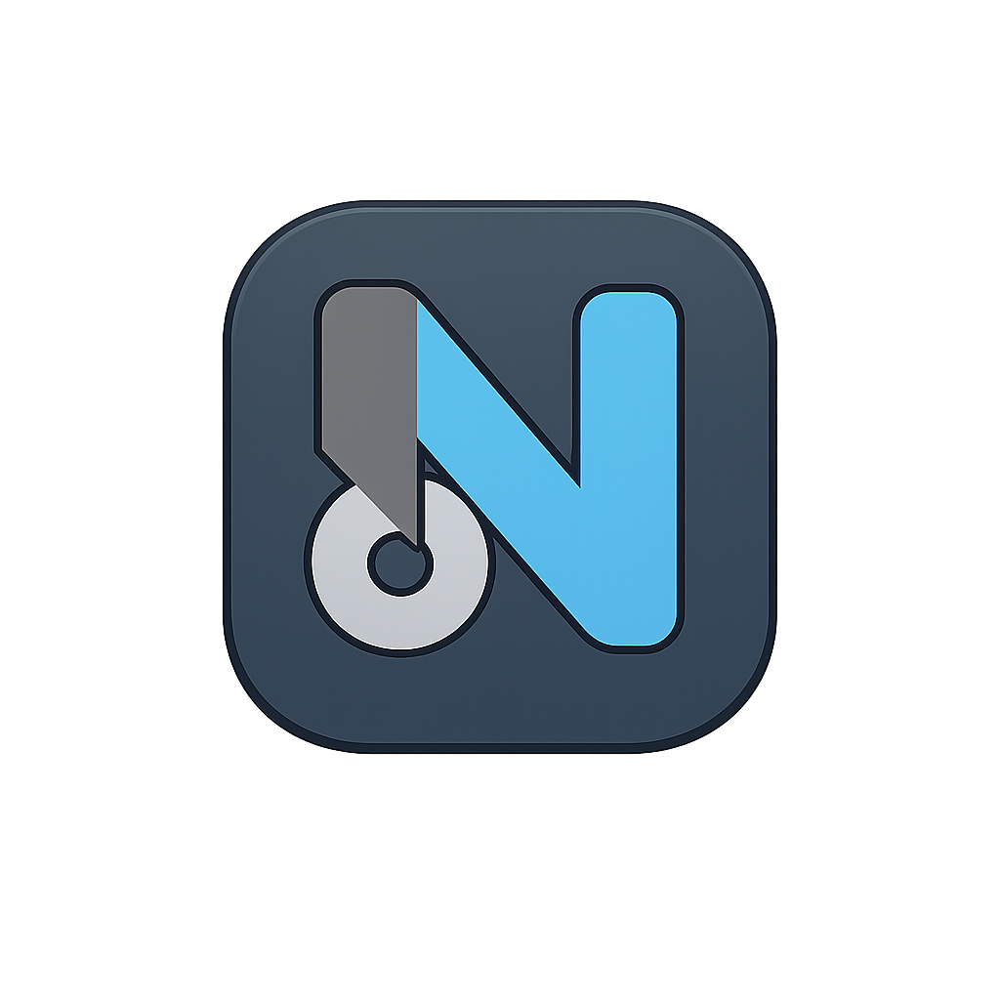

<div align="center">
  
  <h1>Nexus Store</h1>
  <p>Modern e-commerce mobile application for electronics and technology</p>
  
  ## 📲 Download APK

  <a href="https://expo.dev/accounts/krasimirnedov/projects/nexus-store/builds/54ff9e6b-d5d6-430c-bd86-177c27812a36">
    
  </a>
  
 
  <p>
    <strong>⬆️ Click the button above to download directly ⬆️</strong><br />
    or<br />
    <strong>🔗 Alternative link (Google Drive):</strong> 
    <a href="https://drive.google.com/file/d/1VIqjfKutnIYXrgq4RQiuAz_9SfKQNrCb/view?usp=drive_link">Google Drive</a>
  </p>
  
  <p>
    <em>Note: If the direct download link doesn't work, use the Google Drive link above to access the build.</em>
  </p>
</div>

---

## 📲 Installation Guide

### Prerequisites

Before you begin, ensure you have the following installed:

- **Node.js**
- **npm**
- **Expo CLI** - `npm install -g expo-cli`
- **EAS CLI** - `npm install -g eas-cli`
- **Android Studio** (for emulator) or **Expo Go** app on your physical device

---

### 🚀 Quick Start

1. **Clone the repository**

```bash
git clone https://github.com/KNedov/React-Native-Project.git
cd React-Native-Project
```

2. **Install dependencies**

```bash
npm install
```

3. **Start the app**

- On physical device: Scan the QR code with Expo Go app

```bash
npm start
```

- **On virtual device:**
  **First:** Open Android Studio and start an emulator

    **Then:** Run the command

    ```bash
    npm run android
    ```

## ⚙️ Environment Setup

The project includes `.env` files in the repository for **exam evaluation purposes only**.

> ⚠️ **Security Note:** In a real production environment, `.env` files should be added to `.gitignore` and never committed to version control. They are included here to simplify testing for the exam evaluation.

The `.env` file contains Firebase configuration needed to run the app:

- API keys
- Auth domain
- Project ID
- Storage bucket
- Database URL

# 📋 Functional Guide

## 1. Project Overview

- **Application Name:** Nexus Store
- **Application Category / Topic:** E-commerce / Online Shopping

### Main Purpose

Nexus Store is a mobile e-commerce application built with React Native that provides a seamless shopping experience for electronics and technology products. The app allows users to browse products by categories, manage a shopping cart, and complete purchases with ease. It solves the problem of online shopping by offering an intuitive interface where users can create product listings, upload images via camera or gallery, and track their order history. With secure user authentication and persistent session management, Nexus Store delivers a modern and efficient mobile shopping solution.

---

## 2. User Access & Permissions

### Guest (Not Authenticated)

**Available screens and actions:**

- Login Screen
- Register Screen

> ⚠️ Guests cannot browse products, create listings, view cart, or access profile until authenticated.

---

### Authenticated User

> ✅ Authenticated users have access to **TabNavigator** with three main tabs.

#### Main Sections / Tabs:

- **HomeTab** – Browse products, view latest and featured items
- **CreateProductTab** – Add new product listings with images
- **UserTab** – View profile, shopping cart, order history, and logout

#### Details Screens:

- **HomeScreen**
    - First screen in HomeTab (main screen for authenticated users)
    - **Displays:**
        - Latest added product – tapping on product opens **DetailsScreen**
        - Featured products – tapping on product opens **DetailsScreen**
        - Category list – tapping a category opens **CategoryScreen** with filtered products
    - **Pull to refresh:**
        - Users can pull down to reload latest products and featured items

- **CategoryScreen**
    - Entered by tapping a category on HomeScreen
    - **Displays:**
        - List of all products in the selected category
    - **Swipe left action on product:**
        - **If you are the product owner:**
            - Edit button appears
            - Delete button appears
        - **If you are NOT the product owner:**
            - Add to Cart button appears

- **DetailsScreen**
    - Entered by tapping a product on CategoryScreen (or any product list)
    - **Displays:**
        - Full product information:
            - Product name
            - Price
            - Image
            - Description
            - Category
            - "Add to Cart" button

- **ProductFormScreen** (shared screen for Create/Edit)
    - Located in **ProductFormTab** (accessible via tab navigation)
    - **Purpose:** Used for both creating new products and editing existing ones
    - **Entered by:**
        - Tapping the **CreateProductTab** (for new product)
        - Tapping **Edit** button on a product owned by the current user (swipe left action)
    - **Displays:**
        - Form with fields:
            - Product name
            - Price
            - Description
            - Category
            - Image (URL / Camera / Gallery)
    - **Behavior:**
        - If creating a new product → all fields are empty
        - If editing an existing product → fields are pre-filled with current product data
        - Submit button changes contextually:
            - **"Create"** for new items
            - **"Update"** for edits

- **ProfileScreen**
    - First screen in UserTab
    - Displays:
        - User profile information
        - Navigation buttons:
            - **Shopping Cart** – opens CartScreen
            - **My Orders** – opens MyOrdersScreen
            - **Logout** – signs out from the app

- **CartScreen**
    - Located in **UserTab** (accessible via ProfileScreen)
    - **Purpose:** View and manage products added to shopping cart
    - **Entered by:**
        - Tapping **"Shopping Cart"** in ProfileScreen
    - **Displays:**
        - List of products added to cart with:
            - Product name
            - Price
            - Quantity selector (+ / - buttons)
            - Subtotal (without tax)
            - Remove button
        - Total price for all items
        - **"Checkout"** button at the bottom
    - **Actions:**
        - Increase/decrease product quantity
        - Remove products from cart
        - Proceed to CheckoutScreen
    - **Empty State:**
        - If cart is empty, shows:
            - Message: "Your cart is empty"
            - Button: "Continue Shopping" (navigates to HomeTab)

- **CheckoutScreen**
    - Located in **UserTab** (accessed via Cart)
    - **Purpose:** Collect shipping information and complete purchase
    - **Entered by:**
        - Tapping **"Checkout"** button on CartScreen
    - **Displays:**
        - Form with shipping fields:
            - Full Name
            - Address
            - City
            - Postal Code
            - Phone Number
        - Order summary:
            - List of products being purchased
            - Total price
        - **"Place Order"** button at the bottom
    - **Behavior:**
        - After successful order:
            - Cart is cleared
            - Order is saved to order history
            - User is redirected to **MyOrdersScreen**
        - If validation fails:
            - Error messages appear below invalid fields

- **MyOrdersScreen**
    - Located in **UserTab** (accessible via ProfileScreen)
    - **Purpose:** View history of completed orders
    - **Entered by:**
        - Tapping **"My Orders"** in ProfileScreen
        - Automatic redirect after successful checkout
    - **Displays:**
        - List of all past orders with:
            - Order ID/Number
            - Order date
            - Total price
            - Order status (e.g., "Completed", "Processing")
            - Number of items
        - Each order can be tapped to view details
    - **OrderDetailsScreen** (tapping an order):
        - Full order information:
            - Shipping address
            - List of purchased products (name, price, quantity)
            - Total amount
            - Order date and status
    - **Empty State:**
        - If no orders yet:
            - Message: "No orders yet"
            - Button: "Start Shopping" (navigates to HomeTab)
    - **Pull to refresh:**
        - Users can pull down to reload order history

## 3. Authentication & Session Handling

### Authentication Flow

- **App start**
    - Firebase initialized in `App.js`
    - `onAuthStateChanged` listener checks for existing session
    - Loading screen shown while checking (`isLoading = true`)

- **Check authentication status**
    - **If user logged in:** Firebase returns user → `isAuthenticated = true` → shows **TabNavigator** (HomeScreen)
    - **If no user:** Firebase returns null → `isAuthenticated = false` → shows **AuthNavigator** (Login/Register)

- **Login / Register**
    - User submits credentials → `authService.login` or `authService.register`
    - On success → `onAuthStateChanged` triggers with user → app navigates to **HomeScreen**

- **Logout**
    - User taps **"Logout"** → `signOut(auth)` called
    - Session cleared → `onAuthStateChanged` triggers with null → app returns to **LoginScreen**

### Session Persistence

- **Storage:** Firebase Auth with AsyncStorage persistence
- **Auto-login:** On app restart, Firebase automatically reads session from AsyncStorage → user stays logged in

## 4. Navigation Structure

### Root Navigation Logic

- Navigation is split based on authentication status using conditional rendering:
    - **If user is authenticated (`isAuthenticated = true`):**
        - App shows **TabNavigator** (main app with HomeTab, CreateProductTab, UserTab)
    - **If user is not authenticated (`isAuthenticated = false`):**
        - App shows **AuthNavigator** (LoginScreen and RegisterScreen only)
    - **While checking authentication status (`isLoading = true`):**
        - Loading screen is shown

### Nested Navigation

| Tab                | Stack Navigator  | Screens Included                                                                  |
| ------------------ | ---------------- | --------------------------------------------------------------------------------- |
| **HomeTab**        | HomeStack        | HomeScreen → CategoryScreen → ProductDetailsScreen                                |
| **ProductFormTab** | ProductFormStack | ProductFormScreen                                                                 |
| **UserTab**        | UserStack        | ProfileScreen → CartScreen → CheckoutScreen → MyOrdersScreen → OrderDetailsScreen |

- **HomeStack** – allows navigation from Home → Category → Product Details
- **ProductFormStack** – contains ProductFormScreen
    - Stack navigator used for consistency with other tabs
    - Allows potential future screens (e.g., Category selector screen)
- **UserStack** – handles navigation through Profile → Cart → Checkout → My Orders flow
- Each Stack navigator has `headerShown: false` for custom UI

## 5. List → Details Flow

### List / Overview Screen

### List / Overview Screen

**CategoryScreen** serves as the main list/overview screen

- **Displayed data:**
    - List of products from the selected category
    - Each product shows:
        - Product name
        - Price
        - Image
        - Description
        - Color
        - Category

- **User interactions:**
    - **Tap on product** → navigates to DetailsScreen
    - **Swipe left on product** → reveals contextual actions with haptic feedback (vibration):
        - For product owner: Edit and Delete buttons
        - For other users: Add to Cart button

### Details Screen

**ProductDetailsScreen**

- **Navigation triggered by:**
    - Tapping on any product from CategoryScreen
    - Tapping on featured or latest products from HomeScreen

- **Data received via route parameters:**
    - `productId` – used to fetch complete product details from Firebase

## 6. Data Source & Backend

### Backend Type

- **Real backend – Firebase**

The application uses Firebase for all backend services:

- **Firebase Authentication** – handles user registration, login, and session management
- **Cloud Firestore** – stores all application data (products, categories, orders, cart)

## 7. Data Operations (CRUD)

### Read (GET)

- **All products are fetched once when the app starts** in ProductProvider (`loadAllProducts()`)
- Products are then displayed from local state on:
    - **HomeScreen** – latest and featured products (filtered from all products)
    - **CategoryScreen** – products filtered by category (filtered from all products)
    - **ProductDetailsScreen** – receives `productId` via route params and finds the product from local state

### Create (POST)

- Users create new products via **ProductFormScreen** (accessed from CreateProductTab)
- Form includes: name, price, description, category, color, image, discount, (URL/Camera/Gallery)
- On submit, product is saved to Firestore and added to local state

### Update / Delete (Mutation)

- **Both Update and Delete operations are implemented**

- **Update:**
    - Product owners can edit their products via ProductFormScreen (entered by swipe left → Edit)
    - Form is pre-filled with existing data
    - After saving, changes are saved to Firestore and local state updates immediately

- **Delete:**
    - Product owners can delete their products via swipe left → Delete button
    - Confirmation required before deletion
    - After confirmation, product is removed from Firestore and local state

- **UI Update after change:**
    - The app uses ProductProvider with local state management
    - When a product is created, updated, or deleted, the state is updated
    - All screens re-render automatically with the new data (no need to refresh)

## 8. Forms & Validation

### Validation Approach

- **Custom validation logic** with controlled components
- Forms are implemented as **controlled components** using `useState`
- Validation with immediate error feedback

### Forms Used

1. **Login Form** – for user authentication
2. **Register Form** – for new user registration
3. **Product Form** – for creating and editing products
4. **Checkout Form** – for collecting shipping and payment information

## 9. Validation Rules

### Login Form

- **Email field:**
    - Required (message: "Email address is required")
    - Must be valid email format (message: "Please enter a valid email")

- **Password field (multiple rules):**
    - Required (message: "Password is required")
    - Minimum 6 characters (message: "Password must be at least 6 characters long")

### Register Form

- **Name field:**
    - Required (message: "Name is required")
    - Minimum 2 characters (message: "Name must be at least 2 characters long")

- **Email field:**
    - Required (message: "Email is required")
    - Must be valid email format (message: "Please enter a valid email")

- **Password field (multiple rules):**
    - Required (message: "Password is required")
    - Minimum 6 characters (message: "Password must be at least 6 characters long")

- **Confirm Password field:**
    - Required (message: "Please confirm your password")
    - Must match password (message: "Passwords do not match")

### Product Form (Create/Edit)

- **Name field:**
    - Required (message: "Product name is required")
    - Minimum 3 characters (message: "Product name must be at least 3 characters long")
    - Maximum 50 characters (message: "Product name must be less than 50 characters")

- **Color field:**
    - Required (message: "Color is required")
    - Minimum 3 characters (message: "Color must be at least 3 characters long")

- **Description field (multiple rules):**
    - Required (message: "Description is required")
    - Minimum 20 characters (message: "Description must be at least 20 characters long")
    - Maximum 500 characters (message: "Description must be less than 500 characters")

- **Price field:**
    - Required (message: "Price is required")
    - Must be a valid number (message: "Price must be a valid number")
    - Must be greater than 0 (message: "Price must be greater than 0")

- **Discount field:**
    - Required (message: "Discount is required")
    - Must be a valid number (message: "Discount must be a valid number")
    - Must be a whole number (message: "Discount must be a whole number (no decimals)")
    - Must be between 0 and 100 (message: "Discount must be between 0 and 100")

- **Category field:**
    - Required (message: "Please select a category")

- **Image field:**
    - Required (message: "Image is required")

### Checkout Form

- **Full Name field:**
    - Required (message: "Full name is required")

- **Email field:**
    - Required (message: "Email is required")
    - Must be valid email format (message: "Invalid email address")

- **Phone field:**
    - Required (message: "Phone number is required")

- **Address field:**
    - Required (message: "Address is required")

- **City field:**
    - Required (message: "City is required")

- **Postal Code field:**
    - Required (message: "Postal code is required")

### Payment Form (when card is selected)

- **Card Number field:**
    - Required (message: "Card number is required")

- **Name on Card field:**
    - Required (message: "Name on card is required")

- **Expiry Date field (multiple rules):**
    - Required (message: "Expiry date is required")
    - Must match MM/YY format (message: "Invalid expiry date (MM/YY)")

- **CVV field (multiple rules):**
    - Required (message: "CVV is required")
    - Must be 3 or 4 digits (message: "Invalid CVV")

## 10. Native Device Features

### Used Native Feature(s)

**Camera / Image Picker**

The app uses the device camera and image gallery in **ProductFormScreen** when creating or editing a product. This feature allows users to:

- Take photos directly with their device camera
- Select existing images from their gallery
- Upload images to Firebase Storage
- Add visual content to products without needing image URLs

## 11. Typical User Flow

### User Journey 1: Purchasing a Product

1. **User opens the app and logs in**
    - Enters email and password on Login Screen
    - Successfully authenticated → redirected to Home Screen

2. **User browses products**
    - Views latest and featured products on Home Screen
    - Taps a category to see all products in Category Screen
    - Swipes left on a product → taps "Add to Cart"

3. **User completes purchase**
    - Goes to Profile Screen → taps "Shopping Cart"
    - Reviews items in Cart Screen → taps "Checkout"
    - Fills shipping details in Checkout Screen
    - Taps "Place Order" → order is saved

4. **User views order history**
    - Redirected to MyOrders Screen after successful purchase
    - Sees the completed order in the list

---

### User Journey 2: Selling a Product (Same User)

1. **User navigates to Create Product**
2. **Fills product form** (name, price, description, category, color, discount)
3. **Adds product image** (URl, camera or gallery)
4. **Taps "Create"** → product is saved to Firestore
     - **Created products automatically appear** in category lists
5. **Product appears in category lists**
6. **User can manage their products:**
    - **Swipe left on any product** to reveal action buttons
        - **Edit** – opens ProductFormScreen with pre-filled data
        - **Delete** – shows confirmation dialog, then removes product
       
> ℹ️ **Note:** The same user can both buy products and sell their own products. There is no separate admin role - any authenticated user can create and sell products.

## 12. Error & Edge Case Handling

### Error Handling Approach

- All errors are caught in providers and thrown to components
- Components display errors using **Toast notifications**
- Loading states are always cleared using finally blocks

### Authentication Errors

- **Login/Register failures:**
    - Wrong credentials → Toast: "Invalid email or password"
    - Network issues → Toast: "Network Error - Please check your internet connection"
    - Email already in use → Toast: "This email is already registered"
    - Weak password → Toast: "Password must be at least 6 characters"

### Network Errors

- **Connection problems:**
    - No internet connection → Toast: "Network Error - Please check your internet connection"

### Data Errors

- **Product operations:**
    - Failed to load products → Toast: "Error loading products"
    - Failed to create product → Toast: "Error creating product"
    - Failed to delete → Toast: "Error deleting product"
    - Failed to update → Toast: "Error updating product"

### Empty States

- Empty Featured List Message **"No Featured Items"** if Featured List is Empty
- Empty product list: Friendly message **"No products"** when no products in category
- Empty cart: **"Your cart is empty"** with **"Start Shopping"** button
- No orders: **"No orders yet"** with **"Start Shopping"** button
